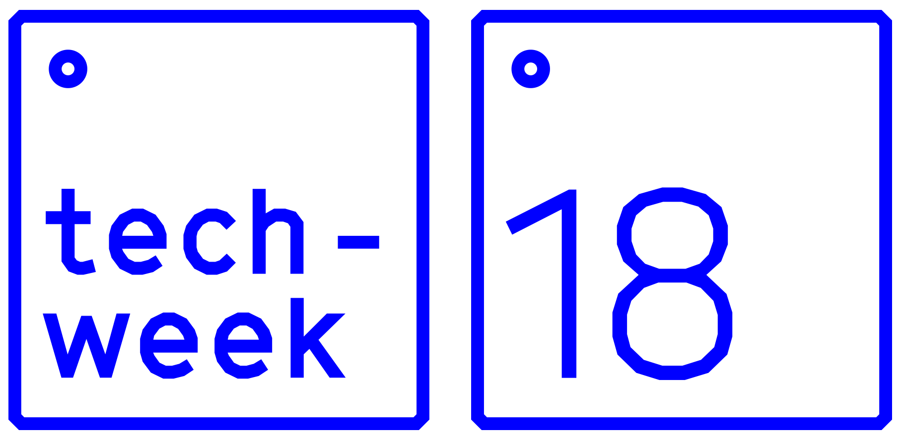
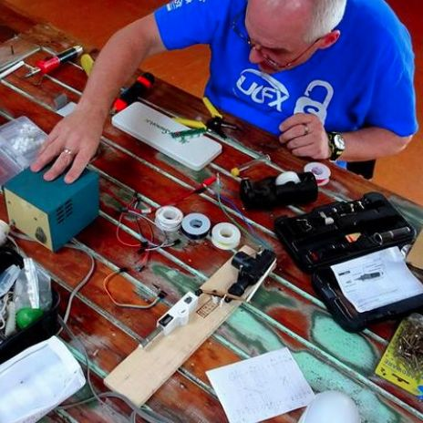

# Welcome to the 2018   Aotearoa Makertrail and   State of the Maker Nation #

### Brought to you by [Meshed](http://meshed.nz) for [TechWeek](http://techweek.co.nz) ###

{:height="50%" width="50%"}  {:height="50%" width="50%"}  

Short updates focused on MakerSpaces in schools, libraries and the community. Experts in each field will give a summary of what is happening now and in the foreseeable future in their respective areas, followed by a round of lightning pitches by groups in the Maker community.

  
**[Andrew Dixon](https://twitter.com/KiwiMrDee)** will be speaking on makerspaces in the community. He has been a founding member of two Auckland based makerspaces, and is currently a trustee of the [Gribblehirst Community Hub](https://ghub.nz/) in Auckland. Through Meshed, Andrew also consults countrywide on maker related issues.

  
**[Mark Osborne](https://twitter.com/mosborne01)** is an expert in future-focused education; innovative and inclusive learning environments. His mission is to help all schools become awesomeness incubators. (This will be a video presentation)

Following these will be a **lightning round** of 3 minute talks from many of the local maker groups that add to the Maker ecosystem in New Zealand.

Feel free to drop [Andrew](mailto:andrew+makertrail@meshed.nz?subject=Enquiry via MakerTrail.NZ&body=Hi, I found this website have queries/would like to participate) a mail should you have any questions - especially if you would like to participate in the lightning rounds.

**[Dunedin](https://www.eventbrite.co.nz/e/state-of-the-maker-nation-dunedin-tickets-44775177762)**  
[Monday,    May 21, 7-9 PM](https://www.eventbrite.co.nz/calendar.ics?eid=44775177762&calendar=ical&date=None)  
[address TBD](https://goo.gl/maps/m5Go4Sigjm12)

**[Christchurch](https://www.eventbrite.co.nz/e/state-of-the-maker-nation-christchurch-tickets-44775205846)**  
[Tuesday,   May 22, 7-9 PM](https://www.eventbrite.co.nz/calendar.ics?eid=44775205846&calendar=ical&date=None)  
[address TBD](https://goo.gl/maps/UPNATiPvBFD2)

**[Wellington](https://www.eventbrite.co.nz/e/state-of-the-maker-nation-wellington-tickets-44775157702)**  
[Wednesday, May 23, 7-9 PM](https://www.eventbrite.co.nz/calendar.ics?eid=44775157702&calendar=ical&date=None)  
[Victoria University of Wellington, Rutherford House Lecture Theatre 2, 33 Bunny St, Pipitea](https://goo.gl/maps/1d97ruHPYFE2)

**[Auckland](https://www.eventbrite.co.nz/e/state-of-the-maker-nation-auckland-tickets-41065451872)**  
[Thursday, May 24, 7-9 PM](https://www.eventbrite.co.nz/calendar.ics?eid=41065451872&calendar=ical&date=None)  
[Auckland University of Technology, Room WG126, 55 Wellesley Street East](https://goo.gl/maps/REgC3Vs8e4T2)

RSVP tickets are [available here](https://www.eventbrite.co.nz/o/meshednz-17095798720)

If you would get in touch, need more info or otherwise participate, please feel free to **[contact us](mailto:kiaora+makertrail@meshed.nz?subject=Enquiry via MakerTrail.NZ&body=Hi, I found this website have queries/would like to participate)**
